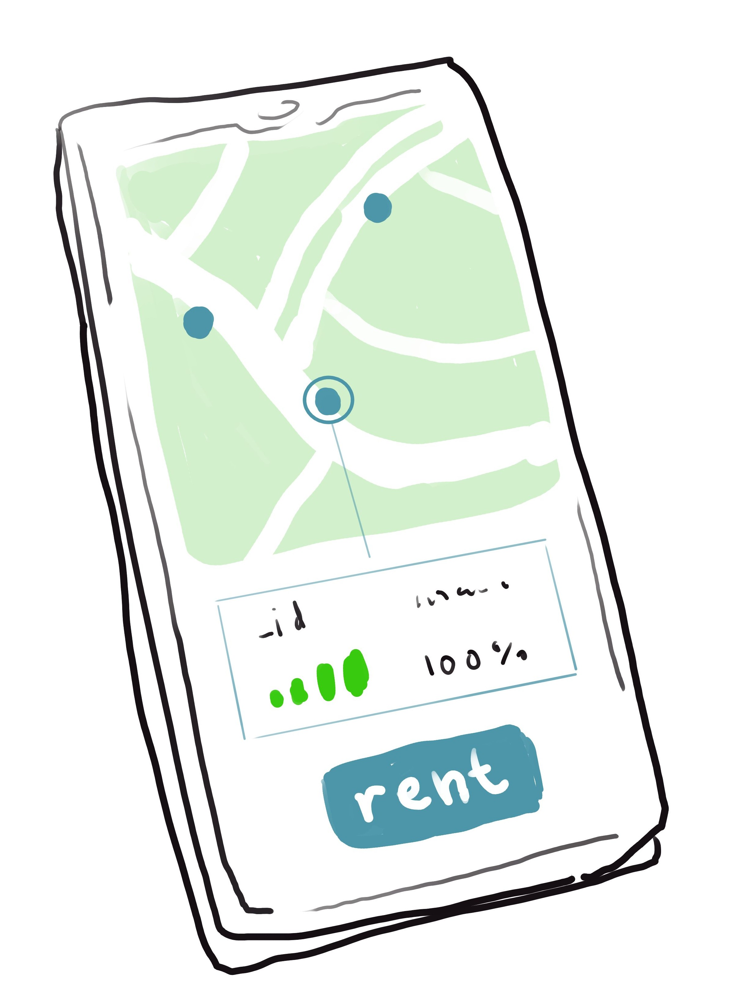

**Förslag början till innehåll under rubriken "Presentation Layer"**

Kunden/användaren använder ett webbgränssnitt för att skapa ett konto och hantera sina användaruppgifter, men för att hyra och använda sparkcyklarna finns det en mobilanpassad webbapp som är designad för enkel och smidig användning av systemets hyrtjänster.

Kundens webbapplikation //*skriver vi något om språk eller ramverk här eller blir det för tekniskt?*// är kundens gränssnitt för att se och hantera sina kontouppgifter och historik. Applikationen kommunicerar via applikationslagret med systemets backend för att låta en inloggad kund uppdatera kontaktuppgifter, se historik för genomförda resor och betalningsinformation. //Här kan kunden även hitta information om regler för användning av systemet (tex det där om tillåten zon, lite info om parkering och sånt) samt lagar/regler för framförande av elsparkcykel i svenska städer. (Jag tänkte att man kan slänga in en sida med länkar till trafikregler (plus uppmaning att använda hjälm) eller whatever och en prislista kanske? Så kunden kan se att det lönar sig att hämta och lämna rätt till exempel? Men det är extra)//

All åtkomst till kundens data kräver autentisering. Även efter inloggning kontrolleras varje förfrågan om data av en autentiseringsfunktion i systemet innan datan hämtas/levereras.

BILD?

Vill kunden av någon anledning avsluta sitt konto måste hen kontakta administratör då kunden inte har behörighet att radera data.

I det mobilanpassade gränssnittet kan kunden på en karta se lediga cyklars position, laddstationer och godkända sparkcykelparkeringar samt stadens tillåtna körzon. När kunden väljer en cykelmarkör på kartan visas dess id och status upp tillsammans med en knapp för att påbörja en hyrsession.

När kunden har påbörjat en hyrsession räknas tiden fram tills kundens återlämnande av cykeln som hyrtiden. Systemet loggar hyrtidens varaktighet samt resans start- och slutposition, vilket används för att räkna ut kostnaden för hyrsessionen.

Mobilgränssnittet ger tillgång till lediga cyklars positioner och relevant platsdata (zoner, parkering etc) men åtkomst till dessa och appens övriga funktioner autentiseras och kräver inloggning med ett giltigt användarkonto.

En påbörjad hyrsession kopplar i systemet ihop en kund med en cykel, så länge en hyrsession pågår kan kunden inte påbörja en ny session utan måste först avsluta den pågående.